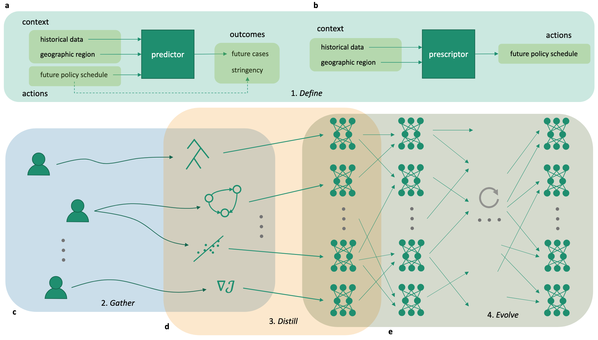

# RHEA - Demo

This is an official repo for the paper Unlocking the Potential of Global Human Expertise (NeurIPS 2024).

This repo contains the implementation of RHEA used in the synthetic Illustrative Domain in the paper.

To install required dependencies: `pip install -r requirements.txt`

To launch a single run use: `python run.py --method <method>` where `<method>` is either `rhea` or `evolution`.

You can use: `./run_parallel.sh` to launch runs in paralell.

Once runs have completed use `python plot_rhea_results.py` to plot the full Pareto discovery success rate of RHEA vs problem dimensionality (Figure 6a in the paper), and `python plot_evolution_results.py` to plot the Pareto coverage percentage of Evolution (Figure 6b).

If you use/reference/extend this work, please use the following citation:

```
@article{meyerson2024unlocking,
  title={Unlocking the Potential of Global Human Expertise},
  author={Meyerson, Elliot and Francon, Olivier and Sargent, Darren, and Hodjat, Babak, and Miikkulainen, Risto},
  journal={Advances in neural information processing systems (NeurIPS 2024)},
  year={2024}
}
```

Enjoy!
